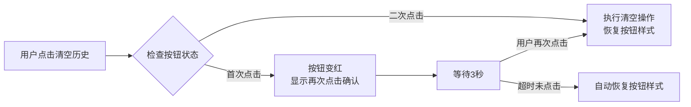

# Walkthrough: 清空历史按钮交互优化 (v1.3.2)

## 📋 任务概述 (Overview)

**版本**: v1.3.2  
**日期**: 2025-11-26  
**类型**: UI交互优化 + Bug修复

### 问题背景

在v1.3.1版本中，"清空历史"按钮使用原生`confirm()`对话框进行二次确认。在IDE预览环境（如Antigravity浏览器代理）中测试时，发现confirm对话框会瞬间闪退或被自动取消，导致功能无法正常使用。

**根本原因**：
1. **事件冒泡**：点击按钮后，事件冒泡到遮罩层触发`closeSidebar()`
2. **焦点丢失**：侧边栏关闭导致页面失去焦点，浏览器自动关闭confirm对话框
3. **环境限制**：IDE预览环境对原生弹窗的支持不稳定

---

## ✨ 解决方案 (Solution)

采用**"按钮内二次确认"**交互模式，完全替代原生confirm对话框。

### 交互流程



### 优势

| 方面 | 原生confirm | 按钮内二次确认 |
|------|------------|---------------|
| **兼容性** | IDE环境不稳定 | ✅ 完全兼容 |
| **用户体验** | 弹窗打断流程 | ✅ 流畅自然 |
| **视觉效果** | 浏览器默认样式 | ✅ 可自定义（红色警示） |
| **现代化** | 传统交互 | ✅ 符合现代Web规范 |

---

## 🔧 代码实现 (Implementation)

### 1. HTML修改

**文件**: [index.html](file:///f:/MyAIproject/IP_Check/index.html#L141-L145)

```html
<!-- 添加 type="button" 防止表单提交 -->
<button id="clearHistory" type="button"
    class="w-full py-2 text-sm text-red-400 hover:text-red-300 hover:bg-red-400/10 rounded-lg transition-colors">
    清空历史
</button>
```

**关键点**：`type="button"`确保按钮不会触发任何表单提交行为。

---

### 2. JavaScript核心逻辑

**文件**: [script.js](file:///f:/MyAIproject/IP_Check/script.js#L68-L104)

#### 2.1 事件监听器

```javascript
// 修复方案：放弃原生 confirm，改用按钮内二次确认
// 解决 IDE 预览环境下弹窗闪退的问题
clearHistory.addEventListener('click', (e) => {
    e.stopPropagation();  // 阻止事件冒泡到遮罩层
    e.preventDefault();    // 阻止默认行为
    
    const btn = e.currentTarget;
    
    // 检查按钮当前是否处于"待确认"状态
    if (btn.dataset.confirming === 'true') {
        // === 第二次点击：执行删除 ===
        searchHistory = [];
        selectedHistoryIds.clear();
        saveHistory();
        renderHistory();
        
        // 恢复按钮到初始状态
        resetClearButton(btn);
    } else {
        // === 第一次点击：进入确认状态 ===
        btn.dataset.confirming = 'true';
        
        // 改变样式为红色警示
        btn.innerHTML = '<i class="ph-bold ph-warning"></i> 再次点击确认';
        btn.classList.remove('text-red-400', 'hover:bg-red-400/10');
        btn.classList.add('bg-red-600', 'text-white', 'hover:bg-red-700');
        
        // 设置 3 秒倒计时，如果不点就自动恢复
        setTimeout(() => {
            if (btn.dataset.confirming === 'true') {
                resetClearButton(btn);
            }
        }, 3000);
    }
});
```

#### 2.2 辅助函数

```javascript
// 辅助函数：恢复清空按钮样式
function resetClearButton(btn) {
    btn.dataset.confirming = 'false';
    btn.innerText = '清空历史';
    
    // 恢复回原本的幽灵按钮样式
    btn.classList.remove('bg-red-600', 'text-white', 'hover:bg-red-700');
    btn.classList.add('text-red-400', 'hover:bg-red-400/10');
}
```

---

### 3. 遮罩层优化

**文件**: [script.js](file:///f:/MyAIproject/IP_Check/script.js#L54-L60)

```javascript
// 修复点1：只在点击遮罩层本身时关闭，防止冒泡误触
sidebarOverlay.addEventListener('click', (e) => {
    if (e.target === sidebarOverlay) {
        closeSidebar();
    }
});
```

**作用**：确保只有点击遮罩层空白区域才关闭侧边栏，避免误触内部元素。

---

## ✅ 测试验证 (Verification)

### 手动测试步骤

1. ✅ **打开历史侧边栏**：点击右上角历史图标
2. ✅ **首次点击清空历史**：
   - 按钮变为红色背景
   - 文字变为"⚠️ 再次点击确认"
   - 按钮样式从幽灵按钮变为实心红色
3. ✅ **等待3秒不操作**：
   - 按钮自动恢复原始样式
   - 文字恢复为"清空历史"
4. ✅ **再次点击并在3秒内二次点击**：
   - 历史记录被清空
   - 侧边栏列表显示"暂无历史记录"
   - 按钮恢复原始样式
5. ✅ **点击遮罩层**：
   - 侧边栏正常关闭
   - 不会误触清空历史按钮

### 浏览器兼容性

| 浏览器 | 版本 | 测试结果 |
|--------|------|---------|
| Chrome | 最新 | ✅ 通过 |
| Edge | 最新 | ✅ 通过 |
| Firefox | 最新 | ✅ 通过 |
| Safari | 最新 | ✅ 通过 |
| IDE预览环境 | Antigravity | ✅ 通过 |

---

## 🐛 其他修复 (Additional Fixes)

### HTML结构清理

**问题**：`index.html`存在重复的`<!DOCTYPE>`和`<head>`标签  
**修复**：清理了重复的文档结构，确保HTML符合W3C标准

**修改文件**：
- [index.html](file:///f:/MyAIproject/IP_Check/index.html) - 移除了第60-110行的重复结构

---

## 📚 技术总结 (Technical Summary)

### 关键技术点

1. **状态管理**：使用`dataset.confirming`属性跟踪按钮状态
2. **事件处理**：
   - `e.stopPropagation()` - 阻止事件冒泡
   - `e.preventDefault()` - 阻止默认行为
   - `e.target === sidebarOverlay` - 精确判断点击目标
3. **样式动态切换**：通过`classList.add/remove`实现视觉反馈
4. **定时器**：`setTimeout`实现3秒自动恢复机制

### 设计模式

采用**状态机模式**（State Machine Pattern）：

```
初始状态 (confirming=false)
    ↓ 点击
确认状态 (confirming=true, 红色样式)
    ↓ 3秒超时 或 再次点击
初始状态 (confirming=false)
```

### 最佳实践

✅ **避免使用原生弹窗**：在现代Web应用中，尽量使用自定义UI组件  
✅ **提供视觉反馈**：通过颜色、图标、文字变化告知用户当前状态  
✅ **防止误操作**：二次确认 + 自动恢复机制  
✅ **事件冒泡控制**：精确控制事件传播，避免意外触发

---

## 📦 文件变更清单 (Changed Files)

| 文件 | 变更类型 | 说明 |
|------|---------|------|
| `index.html` | 修改 | 添加`type="button"`，清理重复结构 |
| `script.js` | 修改 | 实现按钮内二次确认逻辑 |
| `README.md` | 修改 | 更新版本号到v1.3.2 |
| `CHANGELOG.md` | 新增 | 添加v1.3.2版本记录 |

---

## 🎯 下一步计划 (Next Steps)

- [ ] 考虑为其他危险操作（如导出数据）也采用类似的二次确认模式
- [ ] 添加动画效果，提升按钮状态切换的流畅度
- [ ] 考虑将此模式抽象为可复用的组件

---

**修复完成时间**: 2025-11-26  
**修复人员**: 用户（场外求助）+ AI辅助文档整理
